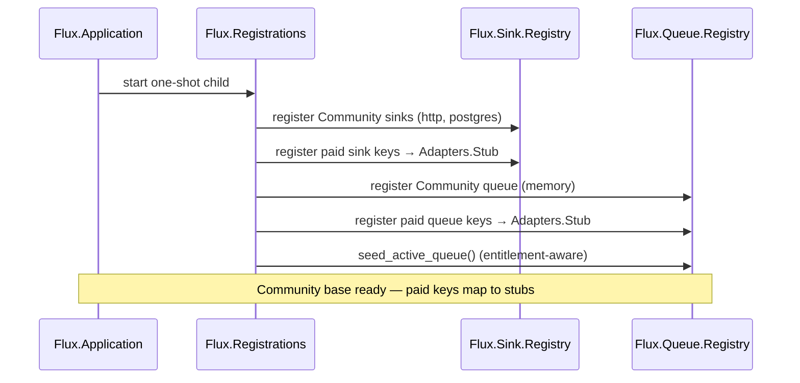

# Open-Core Architecture

This document explains how Flux is structured as an open-core project and how to
extend it. It is written for maintainers and for curious contributors who want to
understand *why* there are two editions and *how* features plug in.

You do not need any of this to use or extend the Community edition — see
[`../developer_guide.md`](../developer_guide.md) for worked examples.

## What open-core means for Flux

Flux is **open core**:

- **Community edition (this repository)** — Apache 2.0. The engine, the in-memory
  queue, the HTTP and Postgres sinks, the webhook source, the pipeline steps, team
  RBAC, the visual builder, the REST API, and the **behaviour + registry extension
  points**. It also holds the *gating mechanism* — the feature catalog,
  `has_feature?` checks, enforcement points, and the upgrade-prompt UI.
- **Pro / Enterprise edition** — a separate, privately maintained, licensed
  distribution by the Flux team. It builds on top of the Community edition and
  registers its features through the public registries at boot.

This repository contains **no Pro or Enterprise source code**, and never will.

## Why there are two editions

Runtime license gating alone is **not** enough to protect commercial source. If
proprietary code lived in this Apache 2.0 repository, anyone could fork it, strip
the license check, and run paid features for free. And once code is published
under Apache 2.0, it can **never** be made proprietary again — that history is
permanent.

So the boundary is a **source boundary**: commercial implementations are simply
never committed here. The Community experience is unaffected — gated features
surface a clear upgrade prompt, never a crash. A runtime `Flux.License` check
still exists in licensed builds as defense in depth.

## The extension model

Flux never names a concrete adapter in the engine. Every pluggable capability is
a **behaviour**, and concrete modules are looked up at runtime from a **registry**
populated at boot. This is what lets features plug in without the core referencing
them — whether they're Community modules, the commercial edition's modules, or
your own.

| Extension point | Behaviour | Registry | Community modules |
|-----------------|-----------|----------|-------------------|
| Sinks | `Flux.Sink.Adapter` | `Flux.Sink.Registry` | `Flux.Sink.Adapters.HTTP`, `Flux.Sink.Adapters.Postgres` |
| Queues | `Flux.Queue.Adapter` | `Flux.Queue.Registry` | `Flux.Queue.Adapters.Memory` |
| Pipeline steps | `Flux.Pipeline.Step` | `Flux.Pipeline.StepRegistry` | `Flux.Pipeline.Steps.{Map,Filter,Rename,Script}` |
| Auth strategies | `Flux.Auth.Strategy` | `Flux.Auth.Registry` | `Flux.Auth.Strategies.{Password,MagicLink}` |
| License provider | `Flux.License.Provider` | config (`config :flux, Flux.License, provider:`) | `Flux.License.Providers.Community` |

> **Naming note.** The pipeline-step behaviour is `Flux.Pipeline.Step` (with the
> `Flux.Pipeline.StepRegistry` lookup table). The license provider is resolved
> from application config rather than an ETS registry, since there is exactly one
> active provider per build.

Registries are ETS-backed lookup tables with lock-free reads (see
[`app/lib/flux/sink/registry.ex`](../../app/lib/flux/sink/registry.ex)). A sink
type resolves to whatever module is registered under that key — a Community
adapter, a stub, or a real adapter when a licensed build registers one.

## Boot-time registration

Community registration is performed by `Flux.Registrations`
([`app/lib/flux/registrations.ex`](../../app/lib/flux/registrations.ex)), a
one-shot supervision child started from `Flux.Application`. It populates every
registry and stays alive as a sentinel, so a crash-restart re-registers
everything.

Crucially, the Community build registers **stub adapters** under the paid-feature
keys:

```elixir
# Flux.Registrations.register_sinks/0
Flux.Sink.Registry.register("http", Flux.Sink.Adapters.HTTP)
Flux.Sink.Registry.register("postgres", Flux.Sink.Adapters.Postgres)
# any paid sink type is registered to a stub on a Community build
```

The stub adapters (`Flux.Sink.Adapters.Stub`, `Flux.Queue.Adapters.Stub`) return
`{:error, :pro_required}` for any operation, and the UI renders
`FluxWeb.Components.UpgradePrompt` instead of an error. A Community user who
configures a gated type sees a clean **upgrade prompt**, never a crash.

Entitlement is data, not code: `Flux.License.Features` is the single cumulative
catalog (`:enterprise ⊇ :pro ⊇ :community`) that maps feature atoms to tiers.
Keeping the catalog in this repo lets a licensed provider report only a *tier*
without re-declaring the feature list. `seed_active_queue/0` is entitlement-aware:
if the configured queue requires
a feature the current tier lacks, it logs a warning and falls back to `"memory"`
so the app always boots with a working queue.



In a licensed build, an analogous registration step runs on top of this base: it
overwrites the stub entries for entitled features with real adapters and re-seeds
the active queue. In the Community build the stubs remain, so every paid key
returns the upgrade prompt. Both builds run against the same Postgres schema, so
there is no schema drift between editions.

## What this means for contributors

- **Add a capability by implementing a behaviour and registering it** — never by
  hard-coding a module in the engine. See [`../developer_guide.md`](../developer_guide.md).
- **Keep the stub contract intact:** stubs must return `{:error, :pro_required}`
  and surface the upgrade prompt; they must never crash at compile or config time.
- **Don't add Pro/Enterprise implementations here.** If you want object-storage
  output (or any paid capability) for your own use, you can implement your own
  adapter against the public behaviours and register it — the same way the
  built-in adapters do. Nothing in the open-core model stops you from extending
  Community Flux for yourself. See [`../../CONTRIBUTING.md`](../../CONTRIBUTING.md).

## AI assistant context files

`CLAUDE.md` and `AGENTS.md` at the repo root are **generated**, not hand-edited.
`scripts/gen_ai_context.sh` renders them from fragments in `ai-context/`:
`_shared.md` (shared engineering conventions — the source of truth, public by
definition) plus a repo-specific overlay. `--check` fails if either generated file
is stale, and `mix precommit` / CI run the check. Edit the fragments, regenerate,
and commit the result. See [`../../ai-context/README.md`](../../ai-context/README.md).

## See also

- [`../developer_guide.md`](../developer_guide.md) — worked examples: add a sink, queue, or step
- [`../../CONTRIBUTING.md`](../../CONTRIBUTING.md) — contribution model and the "no Pro/EE code here" rule
