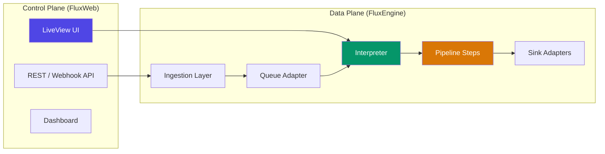
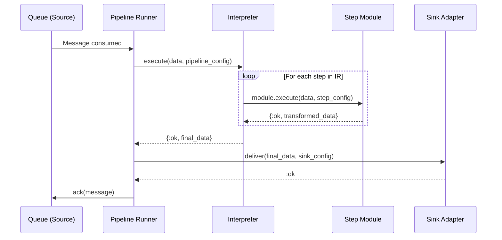

# Flux Developer Guide

This guide covers the internal architecture, extension points, and development conventions for contributing to Flux.

---

## Table of Contents

- [Architecture Overview](#architecture-overview)
- [Adding a New Pipeline Step](#adding-a-new-pipeline-step)
- [Adding a New Sink Adapter](#adding-a-new-sink-adapter)
- [Adding a New Queue Adapter](#adding-a-new-queue-adapter)
- [Testing Conventions](#testing-conventions)
- [AI Assistant Context Files](#ai-assistant-context-files)
- [Code Style](#code-style)

---

## Architecture Overview

### Two-Plane Design

Flux is structured as two logical planes running within a single OTP application:



**Control Plane (`FluxWeb`)**: Phoenix 1.8 LiveView application for management, configuration, and real-time visibility. All UI is built with LiveView and function components, except the pipeline visual builder canvas which uses React Flow (lazy-loaded only on `/pipelines/builder`).

**Data Plane (`FluxEngine`)**: Broadway-based execution engine, Oban scheduler, and pluggable queue/sink adapters. Pipeline transformation steps (map, filter, rename, and Lua `script`) run here.

### Context Modules

| Context | Module | Responsibility |
|---------|--------|----------------|
| Pipelines | `Flux.Pipelines` | Pipeline CRUD, status management, listing by team |
| Sinks | `Flux.Sinks` | Sink CRUD, configuration validation |
| Accounts | `Flux.Accounts` | User registration, authentication, session management, scope building |
| Structure | `Flux.Structure` | Teams, team members |
| Permissions | `Flux.Permissions` | Team-centric role-based access control via `can?/3` |

### Pipeline Execution Flow



The `Flux.Pipeline.Interpreter` receives the pipeline's JSON IR configuration and iterates through each step sequentially. Each step is dispatched based on its `type`:

- `"native"` -- Resolved via `Flux.Pipeline.Step.module_for_operation/1` to compiled Elixir modules (`map`, `filter`, `rename`)
- `"script"` -- Routed to `Flux.Pipeline.Steps.Script` (Lua sandbox via Luerl)

### Supervision Tree

```
Flux.Supervisor (one_for_one)
 |-- FluxWeb.Telemetry
 |-- Flux.Repo
 |-- Phoenix.PubSub (name: Flux.PubSub)
 |-- Queue Adapter (configured via the queue registry)
 |-- Oban
 |-- Registry (Flux.Pipeline.Registry)
 |-- DynamicSupervisor (Flux.Pipeline.DynamicSupervisor)
 |-- Flux.Pipeline.Metrics
 |-- Flux.Pipeline.Manager
 |-- FluxWeb.Endpoint
```

The `Pipeline.Manager` starts after `Metrics` so that telemetry handlers and ETS tables are ready before pipelines begin processing.

---

## Adding a New Pipeline Step

This section walks through adding a custom pipeline step from scratch. We will use a hypothetical `Deduplicate` step as the example.

### Step 1: Create the Step Module

Create a new file at `lib/flux/pipeline/steps/deduplicate.ex`:

```elixir
defmodule Flux.Pipeline.Steps.Deduplicate do
  @moduledoc """
  Deduplicate step that checks a field for uniqueness.

  Config options:
  - `field`: Field name to check for duplicates
  - `strategy`: How to handle duplicates ("skip" or "mark")
  """

  @behaviour Flux.Pipeline.Step

  @impl true
  def execute(data, config) when is_map(data) and is_map(config) do
    field = Map.get(config, "field")

    cond do
      is_nil(field) ->
        {:error, "Deduplicate step requires 'field' in config"}

      true ->
        value = Map.get(data, field)
        strategy = Map.get(config, "strategy", "skip")

        case check_duplicate(value, strategy) do
          :unique ->
            {:ok, data}

          :duplicate when strategy == "skip" ->
            {:skip, :duplicate}

          :duplicate ->
            {:ok, Map.put(data, "_duplicate", true)}
        end
    end
  end

  def execute(_data, _config), do: {:error, "Invalid data or config format"}

  defp check_duplicate(_value, _strategy) do
    # Deduplication logic here (e.g., check ETS, cache, or database)
    :unique
  end
end
```

The behaviour callback must return one of:

| Return Value | Meaning |
|-------------|---------|
| `{:ok, transformed_data}` | Step succeeded; continue to next step |
| `{:skip, reason}` | Skip this message (e.g., filtered out, duplicate) |
| `{:error, reason}` | Step failed; the message is rejected and the error is recorded |

### Step 2: Register in `Flux.Pipeline.Step`

Add a clause to `module_for_operation/1` in `lib/flux/pipeline/step.ex`:

```elixir
def module_for_operation("deduplicate"), do: {:ok, Flux.Pipeline.Steps.Deduplicate}
```

The full function will look like:

```elixir
def module_for_operation("map"), do: {:ok, Flux.Pipeline.Steps.Map}
def module_for_operation("filter"), do: {:ok, Flux.Pipeline.Steps.Filter}
def module_for_operation("rename"), do: {:ok, Flux.Pipeline.Steps.Rename}
def module_for_operation("deduplicate"), do: {:ok, Flux.Pipeline.Steps.Deduplicate}
def module_for_operation(op), do: {:error, "Unknown operation: #{op}"}
```

### Step 3: Verify Interpreter Support

The `Flux.Pipeline.Interpreter` already handles all `"native"` type steps by dispatching through `Step.module_for_operation/1`, so no changes are needed there for standard native steps. The new step will work with this JSON IR:

```json
{
  "id": "dedup-1",
  "type": "native",
  "operation": "deduplicate",
  "config": {
    "field": "event_id",
    "strategy": "skip"
  }
}
```

If your step requires a new `type` (not `"native"` or `"script"`), add a new `execute_step/2` clause in `lib/flux/pipeline/interpreter.ex`.

### Step 4: Add the UI Node in the Visual Builder

Add a new node type to the React Flow canvas in the builder component at `assets/js/builder/`. The node should emit the correct JSON IR when the pipeline is saved.

### Step 5: Write Tests

Create `test/flux/pipeline/steps/deduplicate_test.exs`:

```elixir
defmodule Flux.Pipeline.Steps.DeduplicateTest do
  use ExUnit.Case, async: true

  alias Flux.Pipeline.Steps.Deduplicate

  describe "execute/2" do
    test "passes through unique data" do
      data = %{"event_id" => "abc-123", "payload" => "test"}
      config = %{"field" => "event_id", "strategy" => "skip"}

      assert {:ok, ^data} = Deduplicate.execute(data, config)
    end

    test "returns error when field is missing from config" do
      assert {:error, _reason} = Deduplicate.execute(%{}, %{})
    end

    test "returns error for invalid data format" do
      assert {:error, _reason} = Deduplicate.execute("not a map", %{})
    end
  end
end
```

---

## Adding a New Sink Adapter

Flux discovers sink adapters at runtime through `Flux.Sink.Registry`: each
adapter implements the `Flux.Sink.Adapter` behaviour and registers itself
against a string type identifier at boot. The Community edition ships the
`http` and `postgres` adapters, registered in `Flux.Registrations`. This
section walks through adding your own adapter using a generic `FileSink` that
appends each delivered record to a local file as a line of JSON.

### Step 1: Create the Adapter Module

Create `lib/flux/sink/adapters/file_sink.ex`:

```elixir
defmodule Flux.Sink.Adapters.FileSink do
  @moduledoc """
  Example sink adapter that appends each record to a local file as JSON.

  Config options:
  - `path`: Filesystem path to append to (required)
  """

  @behaviour Flux.Sink.Adapter

  require Logger

  @impl true
  def deliver(data, config, _opts) do
    path = Map.fetch!(config, "path")

    Logger.debug("Appending record to #{path}")

    line = Jason.encode!(data) <> "\n"

    case File.write(path, line, [:append]) do
      :ok -> :ok
      {:error, reason} -> {:error, reason}
    end
  end

  @impl true
  def validate_config(config) do
    case Map.get(config, "path") do
      path when is_binary(path) and path != "" -> :ok
      _ -> {:error, ["path is required"]}
    end
  end

  @impl true
  def test_connection(config) do
    path = Map.get(config, "path", "")
    dir = Path.dirname(path)

    if File.dir?(dir), do: :ok, else: {:error, "directory #{dir} does not exist"}
  end
end
```

The behaviour defines three callbacks:

| Callback | Required | Description |
|----------|----------|-------------|
| `deliver/3` | Yes | Deliver data to the destination |
| `validate_config/1` | Yes | Validate the sink's config map |
| `test_connection/1` | No | Test connectivity to the destination |

### Step 2: Register the Adapter

Adapters self-register at boot. Add your adapter to `register_sinks/0` in
`lib/flux/registrations.ex` so it joins the registry alongside the built-in
Community adapters:

```elixir
defp register_sinks do
  Flux.Sink.Registry.register("http", Flux.Sink.Adapters.HTTP)
  Flux.Sink.Registry.register("postgres", Flux.Sink.Adapters.Postgres)
  Flux.Sink.Registry.register("file", Flux.Sink.Adapters.FileSink)
  :ok
end
```

At dispatch time, `Flux.Sink.deliver/3` looks the type up via
`Flux.Sink.Registry.lookup/1` and calls the resolved adapter — there is no
hard-coded list of adapters to edit.

> Additional sink adapters ship in a separate commercial edition; they register
> themselves at boot the same way.

### Step 3: Add to the Sink Schema

Add the new type to `@sink_types` in `lib/flux/sinks/sink.ex` (the Ecto schema):

```elixir
@sink_types ~w(http postgres file)
```

This ensures the `validate_inclusion(:type, @sink_types)` check in the changeset accepts the new type.

### Step 4: Add the Config Form

Add a form section for the new sink type in the `SinkLive.Form` LiveView. Use the standard `<.input>` component for each configuration field:

```heex
<div :if={@form[:type].value == "file"}>
  <.input field={@form[:config]["path"]} type="text" label="File path" placeholder="/var/log/flux/events.jsonl" />
</div>
```

### Step 5: Write Tests

Create `test/flux/sink/adapters/file_sink_test.exs`:

```elixir
defmodule Flux.Sink.Adapters.FileSinkTest do
  use ExUnit.Case, async: true

  alias Flux.Sink.Adapters.FileSink

  describe "validate_config/1" do
    test "returns :ok for valid config" do
      assert :ok = FileSink.validate_config(%{"path" => "/tmp/events.jsonl"})
    end

    test "returns errors for missing required fields" do
      assert {:error, errors} = FileSink.validate_config(%{})
      assert "path is required" in errors
    end
  end

  describe "deliver/3" do
    test "appends data to the file" do
      path = Path.join(System.tmp_dir!(), "flux_file_sink_#{System.unique_integer([:positive])}.jsonl")
      on_exit(fn -> File.rm(path) end)

      config = %{"path" => path}
      assert :ok = FileSink.deliver(%{"event" => "test"}, config, [])
      assert File.read!(path) =~ ~s("event":"test")
    end
  end
end
```

---

## Adding a New Queue Adapter

Queue adapters follow the same registry pattern as sinks: each implements the
`Flux.Queue.Adapter` behaviour and registers against a string type identifier
via `Flux.Queue.Registry.register/2` at boot. The Community edition ships the
in-memory adapter (`Flux.Queue.Adapters.Memory`), registered under `"memory"`
in `Flux.Registrations`. The active adapter — the one `Flux.Queue` publishes
through — is selected by `config :flux, Flux.Queue, type: "memory"` and seeded
at boot.

### Step 1: Implement the `Flux.Queue.Adapter` Behaviour

Create a new adapter module (e.g., `lib/flux/queue/adapters/redis.ex`):

```elixir
defmodule Flux.Queue.Adapters.Redis do
  @moduledoc """
  Redis-based queue adapter using Redis Streams.
  """

  use GenServer

  @behaviour Flux.Queue.Adapter

  alias Flux.Queue.Message

  def start_link(opts) do
    GenServer.start_link(__MODULE__, opts, name: Keyword.get(opts, :name, __MODULE__))
  end

  @impl Flux.Queue.Adapter
  def publish(queue, %Message{} = message, opts \\ []) do
    GenServer.call(__MODULE__, {:publish, queue, message, opts})
  end

  @impl Flux.Queue.Adapter
  def ack(%Message{} = message) do
    GenServer.call(__MODULE__, {:ack, message})
  end

  @impl Flux.Queue.Adapter
  def reject(%Message{} = message, requeue \\ false) do
    GenServer.call(__MODULE__, {:reject, message, requeue})
  end

  # GenServer callbacks

  @impl true
  def init(_opts) do
    # Initialize Redis connection
    {:ok, %{}}
  end

  @impl true
  def handle_call({:publish, queue, message, _opts}, _from, state) do
    # Publish to Redis Stream
    {:reply, :ok, state}
  end

  @impl true
  def handle_call({:ack, _message}, _from, state) do
    {:reply, :ok, state}
  end

  @impl true
  def handle_call({:reject, _message, _requeue}, _from, state) do
    {:reply, :ok, state}
  end
end
```

The required callbacks are:

| Callback | Required | Description |
|----------|----------|-------------|
| `publish/3` | Yes | Publish a `Flux.Queue.Message` to a named queue |
| `ack/1` | Yes | Acknowledge successful processing of a message |
| `reject/2` | Yes | Reject a message, optionally requeuing it |
| `producer_spec/1` | No | Return the Broadway producer child spec used by `Flux.Pipeline.Runner` to consume messages |

### Step 2: Register the Adapter

Register your adapter at boot in `register_queues/0` in
`lib/flux/registrations.ex`, alongside the built-in in-memory adapter:

```elixir
defp register_queues do
  Flux.Queue.Registry.register("memory", Flux.Queue.Adapters.Memory)
  Flux.Queue.Registry.register("redis", Flux.Queue.Adapters.Redis)
  :ok
end
```

If your adapter runs a process (a GenServer connection, a pool, etc.), add it
as a child in `lib/flux/application.ex` so it starts with the application.

> Additional queue adapters ship in a separate commercial edition; they register
> themselves at boot the same way.

### Step 3: Configure the Active Adapter

Point Flux at your adapter by setting the active queue type. The registry
resolves `Flux.Queue` calls through whichever type is active:

```elixir
# config/runtime.exs
config :flux, Flux.Queue, type: "redis"

config :flux, Flux.Queue.Adapters.Redis,
  url: System.get_env("REDIS_URL") || "redis://localhost:6379",
  stream_prefix: "flux:"
```

---

## Testing Conventions

### Test Structure

| Test type | Base module | Location | Purpose |
|-----------|-------------|----------|---------|
| Unit / Context | `Flux.DataCase` | `test/flux/` | Database-backed tests (contexts, schemas) |
| LiveView / Controller | `FluxWeb.ConnCase` | `test/flux_web/` | HTTP and LiveView integration tests |
| Pure logic | `ExUnit.Case` | `test/flux/` | Side-effect-free unit tests (steps, adapters) |

### Fixtures

Test data fixtures are located in `test/support/fixtures/`:

| Fixture Module | Scope |
|----------------|-------|
| `Flux.AccountsFixtures` | Users, registration, authentication |
| `Flux.PipelinesFixtures` | Pipelines with default configurations |
| `Flux.SinksFixtures` | Sink instances with valid configs |
| `Flux.StructureFixtures` | Teams, team members |

### Process Management

Always use `start_supervised!/1` to start processes in tests:

```elixir
# Good
pid = start_supervised!({Flux.Pipeline.Metrics, name: :test_metrics})

# Bad - process may leak between tests
{:ok, pid} = Flux.Pipeline.Metrics.start_link(name: :test_metrics)
```

Avoid `Process.sleep/1` and `Process.alive?/1`. Instead, use `Process.monitor/1`:

```elixir
ref = Process.monitor(pid)
assert_receive {:DOWN, ^ref, :process, ^pid, :normal}
```

Use `:sys.get_state/1` to synchronize GenServer state before assertions:

```elixir
# Ensure the GenServer has processed all pending casts
_state = :sys.get_state(Flux.Pipeline.Metrics)
```

### Property-Based Testing

Use `StreamData` for property-based tests where applicable:

```elixir
use ExUnitProperties

property "filter step never crashes on arbitrary map data" do
  check all data <- map_of(string(:alphanumeric), term()),
            field <- string(:alphanumeric, min_length: 1) do
    config = %{"field" => field, "operator" => "eq", "value" => "test"}
    result = Flux.Pipeline.Steps.Filter.execute(data, config)
    assert match?({:ok, _} | {:skip, _} | {:error, _}, result)
  end
end
```

### Tags

Use `@tag :load` for load/performance tests that should not run in normal CI:

```elixir
@tag :load
test "handles 10,000 messages without timeout" do
  # ...
end
```

Exclude load tests by default:

```bash
mix test --exclude load
```

### Running Tests

```bash
# Run all tests
mix test

# Run a specific test file
mix test test/flux/pipeline/steps/filter_test.exs

# Run only previously failed tests
mix test --failed

# Run with coverage
mix test --cover

# Run the full precommit check (compile + format + credo + tests)
mix precommit
```

Always run `mix precommit` before committing changes.

---

## AI Assistant Context Files

`CLAUDE.md` and `AGENTS.md` at the repo root are the instructions AI coding tools
(Claude Code, Cursor, Codex, etc.) load automatically. **Both files are
generated — do not edit them directly.** They carry a `GENERATED FILE — DO NOT EDIT`
banner; your changes would be overwritten on the next regen and rejected by CI.

### Why they're committed (not gitignored)

The generated files are checked into git on purpose: AI tools and contributors
read them the moment they clone — before anyone runs a script — and the public
repo relies on them being browsable on GitHub. `mix precommit` and CI run a
`--check` that fails if a committed file has drifted from its source fragments,
so staleness is caught automatically. Treat them like any committed generated
artifact (e.g. a lockfile): edit the source, regenerate, commit both.

### Where the content lives

```
ai-context/
  _shared.md        # shared engineering conventions (source of truth)
  flux.overlay.md   # repo-specific block (Community Edition guardrails)
scripts/
  gen_ai_context.sh # fragments -> CLAUDE.md + AGENTS.md
```

`CLAUDE.md` and `AGENTS.md` are both rendered as: banner + `_shared.md` + the
repo's `*.overlay.md`.

### Editing workflow

1. Edit the right fragment:
   - **Shared conventions** (Phoenix/Elixir/Tailwind/Ecto/test rules, etc.) →
     `ai-context/_shared.md`. This repo is the source of truth for these, which
     are also used by the commercial edition. **Never** put Pro/EE or
     commercial-strategy content here — it is public.
   - **Community-only guardrails** → `ai-context/flux.overlay.md`.
2. Regenerate and commit the result:
   ```bash
   scripts/gen_ai_context.sh        # rewrites CLAUDE.md + AGENTS.md
   git add ai-context/ CLAUDE.md AGENTS.md
   ```
3. `mix precommit` runs `scripts/gen_ai_context.sh --check` and fails if you
   forgot to regenerate.

If you change `_shared.md`, the maintainers handle propagating the shared
conventions to the commercial edition — contributors don't need to.

---

## Code Style

### General Guidelines

Refer to `CLAUDE.md` at the project root for the full set of coding guidelines. Key points are summarized below.

### Elixir

- **Immutable rebinding**: Bind `if`/`case`/`cond` results rather than rebinding inside blocks:

  ```elixir
  # Correct
  socket = if connected?(socket), do: assign(socket, :val, val), else: socket

  # Incorrect - rebinding inside if does not propagate
  if connected?(socket), do: socket = assign(socket, :val, val)
  ```

- **One module per file**: Never nest multiple modules in the same file.
- **Predicate naming**: End predicate functions with `?` (e.g., `valid?/1`, not `is_valid/1`).
- **Struct access**: Use dot notation (`my_struct.field`) or `Ecto.Changeset.get_field/2` -- never map access syntax (`changeset[:field]`) on structs.
- **HTTP client**: Use `Req` (`:req`) for all HTTP requests. Do not introduce `HTTPoison`, `Tesla`, or `:httpc`.
- **Atoms**: Never use `String.to_atom/1` on user input (memory leak risk). Use `String.to_existing_atom/1` or match against known values.

### Phoenix 1.8

- All LiveView templates must begin with `<Layouts.app flash={@flash} ...>`.
- Use imported `<.input>` components for forms with `to_form/2` assigned forms.
- Use `<.icon name="hero-x-mark" class="w-5 h-5"/>` for Heroicons -- never use `Heroicons` modules directly.
- `<.flash_group>` is forbidden outside `layouts.ex`.
- Never use `live_redirect` or `live_patch` (deprecated). Use `<.link navigate={}>` and `push_navigate`/`push_patch`.

### LiveView Streams

Always use streams for collections:

```elixir
# Append
stream(socket, :messages, [new_msg])

# Reset
stream(socket, :messages, items, reset: true)

# Prepend
stream(socket, :messages, [new_msg], at: -1)

# Delete
stream_delete(socket, :messages, msg)
```

Template pattern:

```heex
<div id="messages" phx-update="stream">
  <div :for={{id, msg} <- @streams.messages} id={id}>{msg.text}</div>
</div>
```

### Tailwind CSS v4

- No `tailwind.config.js` is needed. Tailwind v4 uses the import syntax in `app.css`.
- Never use `@apply` in raw CSS.
- Use conditional class lists with array syntax:

  ```heex
  <a class={["px-2 text-white", @flag && "py-5", if(@cond, do: "border-red-500", else: "border-blue-100")]}>
  ```

### Ecto

- Always preload associations when accessed in templates.
- Use `Ecto.Changeset.get_field/2` to read changeset fields -- never access changesets directly in templates.
- Fields set programmatically (e.g., `user_id`, `team_id`) must not appear in `cast` calls.
- Schema fields use `:string` type even for `:text` database columns.

### HEEx Templates

- Always use `~H` sigil or `.html.heex` files -- never `~E`.
- Use `{...}` for attribute interpolation; `<%= %>` for block constructs in tag bodies.
- Never use `else if` or `elsif` -- use `cond` or `case`.
- Never use `<% Enum.each %>` -- use `<%= for item <- @collection do %>`.
- Use `<%!-- comment --%>` for HEEx comments.

### Mix Tasks

- Run `mix precommit` before every commit.
- Use `mix test --failed` to re-run only previously failed tests.
- Read task documentation with `mix help task_name` before using unfamiliar tasks.
- Avoid `mix deps.clean --all` unless absolutely necessary.
