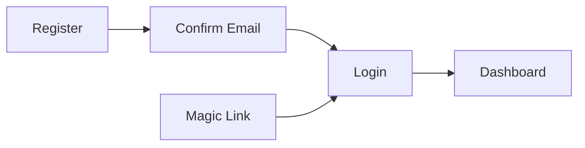
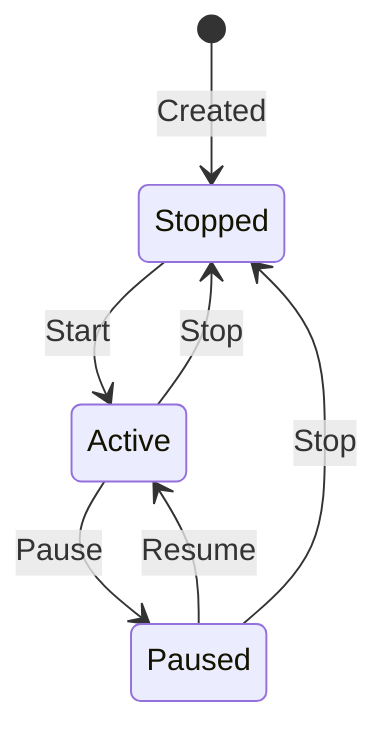

# Flux User Guide

This guide covers how to use the Flux web interface to manage pipelines, sinks, anomaly detection, and system settings.

---

## Table of Contents

- [Getting Started](#getting-started)
- [Dashboard](#dashboard)
- [Managing Pipelines](#managing-pipelines)
- [Visual Pipeline Builder](#visual-pipeline-builder)
- [Managing Sinks](#managing-sinks)
- [Live Signals (Anomaly Detection)](#live-signals-anomaly-detection)
- [System Settings](#system-settings)
- [User Settings](#user-settings)

---

## Getting Started

### Registration

Navigate to `/users/register` to create an account. Provide an email address and password (minimum 12 characters).

### Login

Flux supports two authentication methods at `/users/log-in`:

- **Password login**: Enter your email and password. Optionally check "Keep me logged in" for a persistent session (60 days).
- **Magic link**: Enter your email and click "Send magic link." A one-time login link is sent to your email. Click the link to log in without a password.

### Email Confirmation

New accounts receive a confirmation email. Click the confirmation link to verify your account. You can also confirm from the `/users/log-in/:token` page.

### Sudo Mode

Sensitive actions (changing email, changing password) require re-authentication. When prompted, enter your current password to confirm your identity. Sudo mode lasts 60 minutes before re-authentication is needed again.

### Authentication Flow

---

## Dashboard

**Route**: `/dashboard`

The dashboard provides a real-time overview of your system's health. It displays four metric cards and a system health summary, all updated live every 2 seconds.

### Metric Cards

| Card | Description |
|------|-------------|
| **Active Pipelines** | Number of pipelines with `active` status. Shows how many are currently running |
| **Events / Sec** | Rolling throughput over the last 60 seconds. Shows total processed count below |
| **Anomalies** | Number of pipelines with anomalous z-scores. Red when > 0 ("Requires attention"), green when 0 ("All clear") |
| **Failed Messages** | Lifetime count of messages that failed processing. Yellow-highlighted when > 0 |

### System Health

Below the cards, a System Health panel shows three summary stats: events/sec, active pipeline count, and anomalies detected.

All metrics update in real time via PubSub -- no page refresh needed.

---

## Managing Pipelines

**Route**: `/pipelines`

### Pipeline List

The pipeline list shows all pipelines in your organization in a table with:

- **Name** and optional description
- **Status** badge: Active (green), Paused (yellow), Stopped (gray)
- **Source queue** (the topic the pipeline consumes from)
- **Connected sinks** count
- **Last updated** timestamp

### Pipeline Actions

| Action | Description |
|--------|-------------|
| **Start** | Set pipeline to `active` and spawn a processing runner |
| **Pause** | Temporarily suspend processing (no new messages consumed) |
| **Resume** | Resume a paused pipeline |
| **Stop** | Fully stop the pipeline (must be explicitly restarted) |
| **Delete** | Remove the pipeline (confirmation dialog shown) |

Active pipelines auto-start when the application boots.

### Pipeline Statuses

### Pipeline Detail View

**Route**: `/pipelines/:id`

Shows read-only details for a single pipeline:

- Configuration card (source queue, destination queue, creation/update timestamps)
- Steps preview with type icons and config summaries
- Connected sinks list with enabled/disabled status and type
- Status action buttons (Start, Pause, Resume, Stop)
- Edit in Builder button (opens the visual builder)
- Delete button (danger zone, with confirmation)

---

## Visual Pipeline Builder

**Routes**: `/pipelines/builder` (new) | `/pipelines/:id/builder` (edit)

The visual builder is a full-screen canvas for constructing pipelines by dragging, connecting, and configuring nodes.

### Layout

The builder has three panels:

1. **Left sidebar** -- Node palette with draggable components
2. **Center canvas** -- React Flow diagram where you place and connect nodes
3. **Right sidebar** -- Configuration panel (changes based on selected node/edge)

### Available Node Types

**Processing nodes:**

| Node | Icon | Purpose |
|------|------|---------|
| Source | Arrow down | Queue consumer (entry point for data) |
| Filter | Funnel | Keep or drop messages based on field conditions |
| Transform | Arrow path | Extract and map fields (Map step) |
| Rename | Pencil | Rename a field in the data |
| Script | Code bracket | Custom Lua transformation (see [lua_scripting.md](lua_scripting.md)) |
| AI Detect | CPU chip | Anomaly detection scoring |

**Output nodes:**

| Node | Purpose |
|------|---------|
| Queue | Publish to a destination queue for pipeline chaining |
| Sink nodes | One node per configured sink (HTTP, S3, Postgres) -- dynamically listed from your enabled sinks |

### Building a Pipeline

1. **Name your pipeline** using the text input in the top config bar.
2. **Drag nodes** from the left palette onto the canvas.
3. **Connect nodes** by clicking and dragging from a node's output handle to another node's input handle.
4. **Configure nodes** by selecting them on the canvas -- the right panel shows type-specific configuration fields (e.g., field name, operator, and value for a Filter node).
5. **Save** by clicking the Save Pipeline button in the top bar.

If no sinks are configured yet, the palette shows an "Add Sink" link that navigates to `/sinks/new`.

---

## Managing Sinks

**Routes**: `/sinks` (list) | `/sinks/new` (create) | `/sinks/:id/edit` (edit)

Sinks are output destinations where processed pipeline data is delivered.

### Sink List

The sink list shows all sinks in your organization:

- **Name** with type icon
- **Type** badge: HTTP, S3, Postgres
- **Enabled/Disabled** status
- **Last updated** timestamp

### Sink Actions

| Action | Description |
|--------|-------------|
| **Test Connection** | Verify connectivity to the destination (HEAD request for HTTP, head_bucket for S3, SELECT 1 for Postgres) |
| **Toggle Enable/Disable** | Enable or disable the sink without deleting it |
| **Edit** | Open the sink configuration form |
| **Delete** | Remove the sink (confirmation dialog shown) |

### Creating / Editing a Sink

The sink form has two sections:

**1. Basic Information:**
- Name (required, unique within your organization)
- Description (optional)

**2. Sink Type** (select one):

#### HTTP Sink
Send data as HTTP requests (webhooks).

| Field | Description |
|-------|-------------|
| URL | Destination URL |
| Method | POST, PUT, PATCH, or DELETE |
| Headers | Optional HTTP headers map |
| Authentication | Bearer token, Basic auth, or API key header |
| Timeout | Request timeout in seconds (default: 30) |
| Retry attempts | Number of retries on failure (default: 3) |

#### S3 Sink
Write data to S3-compatible object storage (AWS S3, MinIO, GCP Cloud Storage).

| Field | Description |
|-------|-------------|
| Bucket | S3 bucket name |
| Region | AWS region |
| Access Key ID | AWS access key |
| Secret Access Key | AWS secret key |
| Key Template | Object key with placeholders: `{id}`, `{timestamp}`, `{date}`, `{pipeline_id}`, `{field.path}` |
| Endpoint | Custom endpoint URL for S3-compatible services (e.g., MinIO) |

#### Postgres Sink
Insert data directly into a PostgreSQL table.

| Field | Description |
|-------|-------------|
| Mode | Internal (app's own database) or External (separate DB) |
| Database URL | Connection URL (external mode only) |
| Table | Target table name |
| Column Mapping | Map data fields to table columns (supports nested paths with dot notation) |
| On Conflict | Strategy for duplicate keys: `nothing`, `replace_all`, or `raise` |

---

## Live Signals (Anomaly Detection)

**Route**: `/intelligence/signals`

The Live Signals page provides real-time AI-powered anomaly monitoring across all pipelines. Data refreshes automatically every 5 seconds.

### Summary Cards

Three cards at the top of the page:

| Card | Description |
|------|-------------|
| **Active Anomalies** | Count of pipelines with z-scores above threshold (pulsing alert when > 0) |
| **Highest Z-Score** | Maximum z-score across all monitored fields |
| **Pipelines Monitored** | Number of pipelines with anomaly detection data |

### Pipeline Anomaly Table

A table listing all monitored pipelines with:

- Pipeline name and processing status
- Maximum z-score across fields
- Number of monitored fields
- Signal indicator: pulsing red dot for anomaly, green dot for normal

### Field Detail View

Click a pipeline row to expand a detailed breakdown:

- **Field statistics table** showing per-field: field name, z-score (color-coded), value count, min, max, and anomaly/normal badge
- **Value history chart** (uPlot) with multi-line time series, color-coded per field, and a draggable cursor for exploration

### Z-Score Color Coding

| Z-Score | Color | Meaning |
|---------|-------|---------|
| > 3.0 | Red | Strong anomaly |
| > 2.0 | Yellow/Warning | Potential anomaly |
| <= 2.0 | Green | Normal |

---

## System Settings

**Route**: `/system/settings`

System settings are restricted to users with the **owner** role. Non-owners see a 403 Forbidden page with an automatic redirect countdown.

### Teams Management

- View all teams in your organization
- Create new teams (name and optional description)
- Edit team name and description
- Delete teams

### Members Management

Manage organization or team members depending on your RBAC mode:

- View members with their roles and status
- Add new members (by email, with role assignment)
- Edit member roles (Admin, Member, Viewer)
- Disable or re-enable members (soft-disable preserves audit trail)
- Remove members (you cannot remove yourself)

In **team-centric** mode, members are managed per team with first/last name fields. In **org-centric** mode, members are managed at the organization level.

See [rbac.md](rbac.md) for details on roles and permissions.

---

## User Settings

**Route**: `/users/settings`

Requires [sudo mode](#sudo-mode) (re-authentication with your current password).

### Change Email

Enter a new email address. A confirmation link is sent to the new address. Your email is not updated until you click the confirmation link.

### Change Password

Enter your new password (minimum 12 characters) and confirm it. Your password is updated immediately and all other sessions are logged out.
